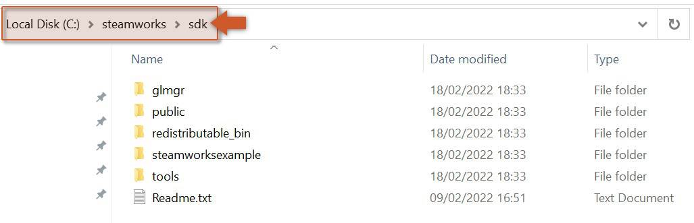
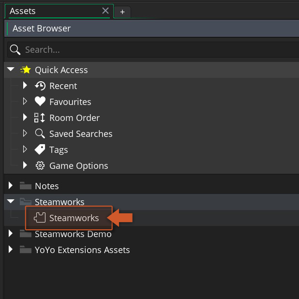
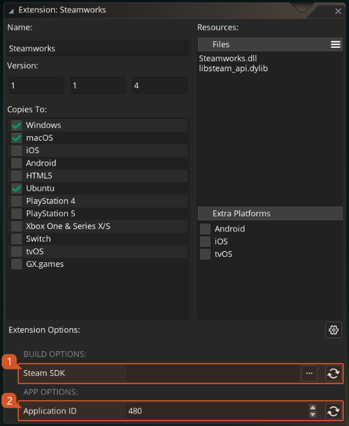

@title Getting Started (IDE/Runtime 2022.6+)

To use the Steam API extension you should follow these steps:

1. Import this Steamworks extension into your project, if you haven't done that already.

2. The Steam app needs to be **installed**, **running** and with an account **logged in** ([official site](https://store.steampowered.com/)).

3. Download Steamworks SDK (1.63) from Steam's [partner site](https://partner.steamgames.com/dashboard) and extract the contents of the zip into a directory of your choice (e.g.: `C:\steamworks\sdk`).

4. To set up your AppID and environment status, double-click on the Steamworks extension in your Asset Browser in the IDE.

5. In the bottom section you will see the new extension options. Those are all you will need to configure to use this extension. The build options require the path to the SDK downloaded on step 3 and the application options required your Application ID. See ${page.extension_options} for what each one does.

