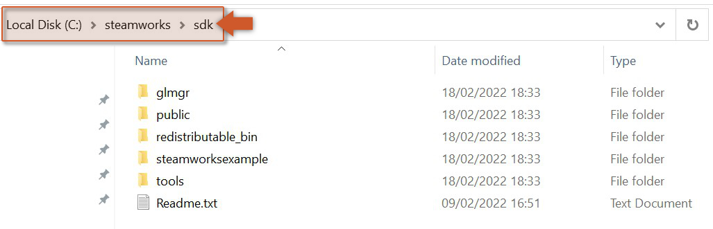
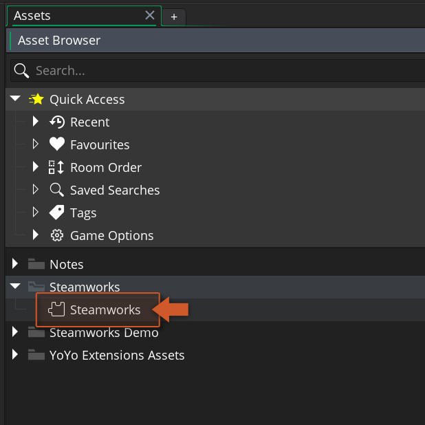
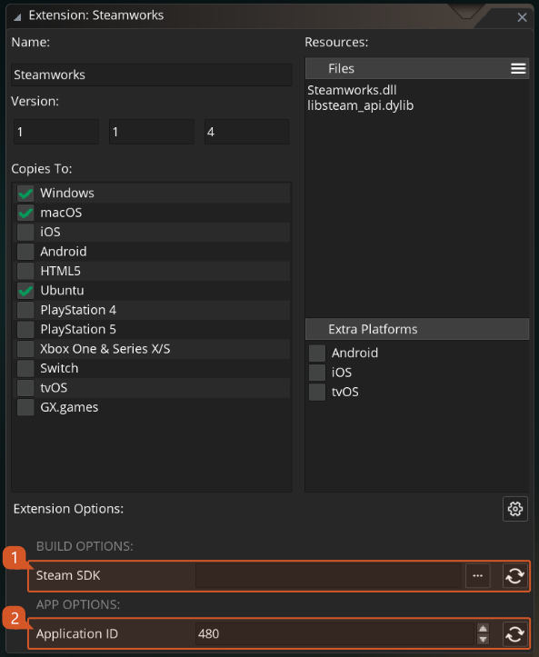

@title Getting Started

# Getting Started

To use the Steamworks extension, follow these steps:

1. Import this Steamworks extension into your project, if you haven't done that already.
2. The Steam client needs to be **installed**, **running** and with an account **logged in** ([official site](https://store.steampowered.com/)) while testing from the IDE.
3. Download the Steamworks SDK (version 1.63) from the [Steamworks partner site](https://partner.steamgames.com/dashboard) and extract the contents of the zip into a directory of your choice (e.g. `C:\steamworks\sdk`).

   

4. To configure the extension, double-click on the Steamworks extension in your Asset Browser in the IDE.

   

5. At the bottom of the extension window you will find the configurable options, grouped into **Build Options**, **App Options** and **Extra Options**.

   

   The **Steam SDK** build option must point at the folder you extracted in step 3, and the **Application ID** app option must hold your game's app ID from the [Steamworks dashboard](https://partner.steamgames.com/dashboard). Full details on every option: ${page.extension_options}.

[[Note: While developing from the IDE, set **Debug** to `Enabled`. With `Auto`, a game that was not launched through Steam is relaunched through it and the process started by the IDE exits at once. Set it back to `Auto` before publishing.]]

# Initialising

There is nothing to call: the extension initialises the Steamworks API before the first frame, using the **Application ID** from the extension options. Check that it succeeded before using any other function, and read the reason if it did not:

```gml
/// Create Event
if (!steam_api_is_initialized())
{
    show_debug_message("Steam init failed: " + steam_api_last_error());
}
```

The above code checks the result of the automatic initialisation with ${function.steam_api_is_initialized}, and prints the failure reason from ${function.steam_api_last_error} when it did not succeed. The usual reasons are the Steam client not running, or the wrong app ID.

# Running the callbacks

Everything asynchronous in this extension - every callback passed to a function, and every callback set with a `steam_*_set_callback_*` function - is delivered by ${function.steam_api_run_callbacks}. You must call it every frame from a persistent controller object, or no callback will ever fire:

```gml
/// Step Event
steam_api_run_callbacks();
```

The above code dispatches the pending Steam callbacks once per step.

# Calling a function

Synchronous functions return their result directly:

```gml
/// Create Event
show_debug_message("Hello " + steam_friends_get_persona_name());
```

Asynchronous functions take a callback as their last argument and return nothing useful themselves; the result arrives later, during a call to ${function.steam_api_run_callbacks}, as a single struct argument:

```gml
/// Mouse Left Pressed Event
steam_userstats_find_leaderboard("HighScores", function(_result)
{
    if (_result.leaderboard_found)
    {
        leaderboard_handle = _result.leaderboard_handle;
    }
    else
    {
        show_debug_message("Leaderboard not found");
    }
});
```

The above code asks Steam for the handle of the leaderboard named "HighScores" with ${function.steam_userstats_find_leaderboard}. The callback runs once, with a ${struct.SteamUserStatsLeaderboardFindResult} struct: when `leaderboard_found` is `true` the handle is stored in an instance variable for later use, otherwise a message is printed. Each function's page lists the struct its callback receives.

# Handling Steam events

Events that Steam raises on its own - the overlay opening, a friend's status changing, a lobby invite arriving - are delivered to a callback you register once with the matching `steam_*_set_callback_*` function, and stop when you call the matching `steam_*_clear_callback_*` function:

```gml
/// Create Event
steam_friends_set_callback_game_overlay_activated(function(_result)
{
    global.paused = _result.active;
});
```

The above code registers a callback with ${function.steam_friends_set_callback_game_overlay_activated} that pauses the game while the Steam overlay is open. The callback receives a ${struct.SteamFriendsGameOverlayActivated} struct every time the overlay is shown or hidden.

# Shutting down

There is nothing to call: the extension shuts the Steamworks API down when the game ends, clearing every registered callback. ${function.steam_api_shutdown} exists only for the rare case where you want to stop using Steam earlier.

# Testing

Run the game from the IDE with **Debug** set to `Enabled` and the Steam client logged in. With the default **Application ID** of `480` (Valve's test app, Spacewar) the extension initialises without a Steamworks account of your own, which is enough to try the friends, overlay and inventory functions. Achievements, stats and leaderboards need your own app ID and their definitions set up on the Steamworks dashboard first.
