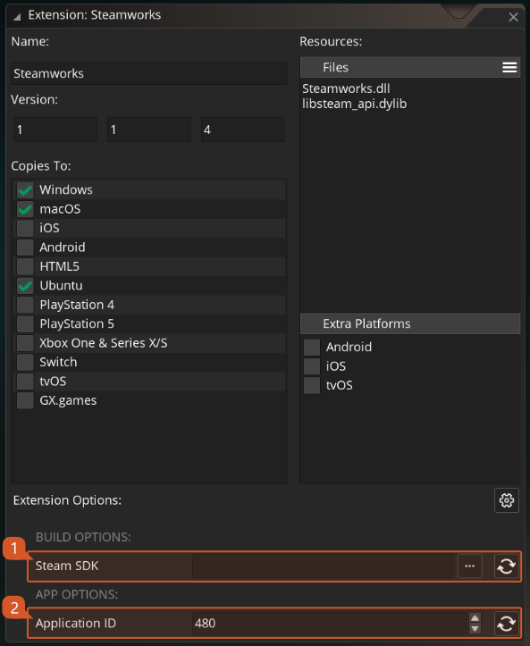

@title Setup Guide (IDE/Runtime 2022.6+)

To use the Steam API extension you should follow these steps:

1. Import this Steamworks extension into your project, if you haven't done that already.

2. The Steam app needs to be **installed**, **running** and with an account **logged in** ([official site](https://store.steampowered.com/)).

3. Download Steamworks SDK (1.61) from Steam's [partner site](https://partner.steamgames.com/dashboard) and extract the contents of the zip into a directory of your choice (e.g.: `C:\steamworks\sdk`).

4. To set up your AppID and environment status, double-click on the Steamworks extension in your Asset Browser in the IDE.

5. In the bottom section you will see the new extension options. Those are all you will need to configure to use this extension. The build options require the path to the SDK downloaded on step 3 and the application options required your Application ID.

* **Steam Options**

  * **Steam SDK**: The path to the folder where you unzipped the downloaded SDK.

  * **Application ID**: The Steam App ID for you game (retrieved from the dashboard).
  
  * **Debug**: This is a flag option that allows you to force debug mode or set it to automatic. Debug mode will allow exports of your game to run a non-steam version of your game (warning, this should be only used during developement). We suggest leaving this set to `Auto`.

* **Build Options**

  * **Log Level**: The log level to be used when executing the script files.
    - 0: Show only errors
    - 1: Show errors and warnings (recommended)
    - 2: Show everything (use before submitting a bug)

# Migration Changes

  During the migration of the Steamworks function library from the base GameMaker runner into this extension, there were some new functions that were added, and others that were slightly changed. This document covers the changes that happened during that migration.

## Changed Functions

  These are the functions that changed:

* [steam_create_leaderboard](leaderboards#steam_create_leaderboard)

> This function is now asynchronous, meaning it will return an Async request ID that should be used inside a [Steam Async Event](https://manual-en.yoyogames.com/The_Asset_Editors/Object_Properties/Async_Events/Steam.htm) to check when the task is finished.

## New Functions

  These are the new functions that were added to the Steam extension:

* [steam_update](management#steam_update) :warning: REQUIRED
* [steam_is_subscribed](general#steam_is_subscribed)
* [steam_set_warning_message_hook](general#steam_set_warning_message_hook)
* [steam_upload_score_ext](leaderboards#steam_upload_score_ext)
* [steam_upload_score_buffer_ext](leaderboards#steam_upload_score_buffer_ext)
* [steam_ugc_delete_item](ugc#steam_ugc_delete_item)

  

---